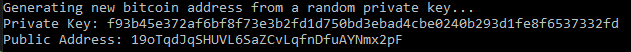
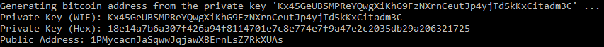

# BitcoinLibFSharp

This F# library provides the ability to generate bitcoin addresses using a randomly generated private key or your own private key. Your own private key can be supplied in raw binary form, hexadecimal format, or Wallet Input Format (WIF). The library provides information about the address including: 
* Private Key in Hexadecimal
* Private Key in Wallet Input Format
* Public Key Compressed
* Public Key Full
* Public Key Hash160
* Pay To Public Key Hash (V1) Address in Hexadecimal
* Pay To Public Key Hash (V1) Address in Base58
* Pay To Script Hash Address in Hexadecimal
* Pay To Script Hash Address in Base58

## Development

I'm building this in Windows using Visual Studio 2019 with the .NET Core 2.2 SDK.
Check out https://dotnet.microsoft.com/download/visual-studio-sdks to get the correct SDK for your version of Visual Studio.

## Usage

To generate a new address from a random private key, you can call the `GenerateNewRandomBitcoinAddressRecord` function, which will return a `Result` type. Decompose the result to access the newly generated address record (or the error string if there was an error).
```f#
    // Returns a new BitcoinAddressRecord Result
    let newAddressRecord = BitcoinAddress.GenerateNewRandomBitcoinAddressRecord true
    
    // Decompose Result
    match newAddressRecord with
    | Ok newAddress ->
        printfn "Generating new bitcoin address from a random private key..."
        printfn "Private Key: %s" newAddress.PrivateKeyHex
        printfn "Public Address: %s" newAddress.P2PKHAddress
    | Error message -> printfn  "Error generating bitcoin address: %s" message
```
This example will output the following:

(NOTE: Do not send bitcoin to these addresses! The private keys are clearly exposed here and anyone can use these addresses.)



If you have your own private key, you can generate an address with one of the following functions depending on what format your private key is stored in:
* `GenerateBitcoinAddressRecordFromPrivateKeyWIF`
* `GenerateBitcoinAddressRecordFromPrivateKeyHx`

Here's an example using a WIF key:
```f#
    // Returns a new BitcoinAddressRecord Result
    let wifPrivateKey = "Kx45GeUBSMPReYQwgXiKhG9FzNXrnCeutJp4yjTd5kKxCitadm3C"
    let addressRecord = BitcoinAddress.GenerateBitcoinAddressRecordFromPrivateKeyWIF true wifPrivateKey
    
    // Decompose Result
    match addressRecord with
    | Ok address ->     
        printfn "Generating bitcoin address from the private key '%s ..." wifPrivateKey
        printfn "Private Key (WIF): %s" address.PrivateKeyWIF
        printfn "Private Key (Hex): %s" address.PrivateKeyHex
        printfn "Public Address: %s" address.P2PKHAddress
    | Error message ->  printfn  "Error generating bitcoin address: %s" message
```

And the output generated:



## Future Work
The things I plan on implementing next include:
1) Bech32 address support
2) Block parsing and block chain parsing/validation
3) Network Protocol support

## Contributing
Pull requests are welcome. For major changes, please open an issue first to discuss what you would like to change.

Please make sure to update tests as appropriate.

## License
[MIT](https://choosealicense.com/licenses/mit/)
